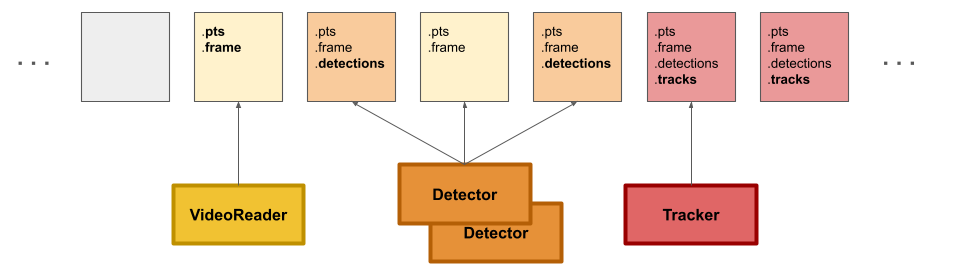

video-pipeline (title todo)
==============


A simple pipeline engine in python with minimal dependencies.


## Features

- Simple and easy to use
- Minimal dependencies
- Multi-threaded with multi-process support
- Adaptive rate limiting
- DAG-based execution
- Extensible and customizable

## Installation

```bash
git clone git@github.com:deigen/video-pipeline.git
cd video-pipeline
pip install .
```

## Usage

Example detect + track pipeline with multiprocessing and two detector instances:

```python
import pipeline as pl
from pipline.detector import HFetector
from pipline.tracker import Tracker

reader = pl.VideoReader("video.mp4")

detector = pl.Multiprocess(HFDetector, model_name='PekingU/rtdetr_v2_r18vd')
detector.num_instances(2)  # Run two instances of the detector in parallel

tracker = pl.Multiprocess(Tracker)

printer = pl.Print(
    lambda data:
    f'pts={data.pts}  tracked={len(data.tracked_objects.tracker_id)}  detected={len(data.detections["boxes"])}  fps={engine.get_fps():.3f}'
)

engine = pl.PipelineEngine()

engine.add(
    reader
    | detector
    | tracker
    | printer
)

engine.run()
```

See the [examples](examples) directory for additional examples, including real-time
processing, adaptive rate limiting, writing to video files and rtsp streams,
and other components.


Implementation Overview
=======================

Each Component in the pipeline runs in its own thread, consuming data as it
becomes ready for that component.  Data is sent to each component by the
pipeline Engine, which continuously checks dependencies between components.
Dependencies are declared using the `|` operator.

Components can also be run in a separate process by wrapping them in a `Multiprocess`,
and can run with more than one process instance using `.num_instances(n)`.

Even though components run in separate threads/processes, data (frames) are always passed
through each component *in order*.  This means that operations like tracking can be done
on the in-order serialized stream, even when other components are run in parallel.

In contrast to some other pipeline engines, sources and sinks are not handled
as special components.  Instead, they are just regular components that can
add or read data fields.  An infinite stream of empty data objects is created
by the engine for the first components to populate (e.g. `VideoReader`), which is then
passed through the rest of the pipeline.




## Components

Components are the building blocks of the pipeline.  Each runs in its own thread (or threads)
and processes data as it becomes available.  Data processing is done by the `process` method,
which takes a `FrameData` object as input and modifies it in place.

```python
class MyComponent:
    def process(self, data: FrameData):
        # Process the data and modify it in place
        frame = data.frame  # Access the frame
        data.img_mean = np.asarray(frame).mean()  # Example processing
```


## FrameData class

The `FrameData` class is used to pass data between components.  It is a simple
storage class that holds key-value pairs.  Names of the keys ("frame", "pts", etc)
can be established by convention and/or remapped to different names during pipeline setup.


## Mapping Field Names

Data fields used by components can be mapped during pipeline setup in order to run
components that expect different field names, using the `.fields()` method.  For example:

```python
class Annotate(pl.Component):
    def process(self, data: pl.FrameData):
        # Annotate the frame with detection boxes using an outside annotate_frame function
        data.annotated_frame = annotate_frame(data.frame, data.detections)

# video writer whose data.frame in its process funciton is now the annotated_frame
writer = pl.VideoWriter("output.mp4").fields(frame='annotated_frame')
```

## Dropping Frames and Rate Limiting

If a component decides a frame should be dropped from further processing, it
can signal this to the engine by raising a Drop exception.  The engine will
then mark the frame as dropped and skip processing by downstream components.

Rate limiting can be done by using the `FixedRateLimiter` or
`AdaptiveRateLimiter` components, which limit their output rate either to a fixed
number of frames per second, or adaptively to match the throughput of the pipeline.
Frames are dropped if the output rate is too high (though this can be configured
to sleep instead of dropping frames).  See the [examples](examples) directory for
examples of rate limiting.

## Stopping the Pipeline

The pipeline can be ended by calling the `stop()` method on the `PipelineEngine` instance,
or by any component themselves by raising the `StreamEnd` exception.  This will tell the
engine to stop creating new data objects, finish processing any in-process data, and exit.

